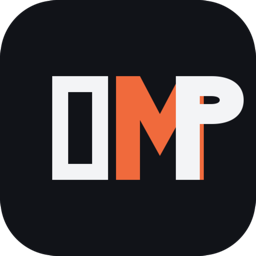

<p align="center">
  
</p>

<h1 align="center">OMP Desktop</h1>

<p align="center"><strong>Open-source Tauri/React desktop shell adapted to the OMP Runtime</strong></p>

<p align="center">
  <a href="./README.md">English</a> ·
  <a href="./README_ZH.md">中文</a>
</p>

<p align="center">
  <a href="LICENSE"></a>
  <a href="https://github.com/Po1nt9/omp-desktop/stargazers"></a>
  
  
</p>

---

> [!NOTE]
> OMP Desktop is an open-source Tauri/React desktop shell being adapted to the OMP Runtime.
> The Plan 1 baseline is intentionally fail-closed: Agent execution, Provider authentication,
> and runtime-owned configuration are unavailable until the versioned OMP integration lands.

---

## Contents

1. [Overview](#overview)
2. [Status](#status)
3. [Development](#development)
4. [Platforms](#platforms)
5. [Install & First Run / 安装与首次运行](#install--first-run--安装与首次运行)
6. [Provenance](#provenance)
7. [Documentation](#documentation)
8. [Contributing](#contributing)
9. [License](#license)

---

## Overview

OMP Desktop is a Tauri 2 + React + TypeScript desktop shell. It is being adapted from
the upstream `RongleCat/grok-app` project (MIT) into a host for the OMP Runtime.

**Stack:** Tauri 2 + Rust · React + TypeScript + Vite · Tailwind CSS

The OMP Runtime source is pinned as a git submodule at `runtime/oh-my-pi`.

## Status

The Plan 1 baseline is intentionally fail-closed. The following surfaces return
`runtime_unavailable` and are not yet wired to a live runtime:

- Agent execution (no prompts run)
- Provider authentication (no sign-in)
- Runtime-owned configuration (no model catalog, no fallback model)

Do not advertise or document these as working capabilities yet. The frozen master
design lives at
[`docs/superpowers/specs/2026-07-28-omp-desktop-design.md`](./docs/superpowers/specs/2026-07-28-omp-desktop-design.md).

## Development

Requirements: Node 22+, pnpm 9, Rust stable, Xcode CLT (macOS).

```bash
pnpm install

pnpm dev          # full app (Tauri + Vite)
pnpm dev:ui       # frontend only

pnpm typecheck
pnpm test
cd src-tauri && cargo test

pnpm build
```

## Platforms

OMP Desktop targets three operating systems:

| Platform | Target |
|----------|--------|
| macOS | Apple Silicon + Intel |
| Windows | x64 |
| Linux | x64 (AppImage / deb / rpm) |

## Install & First Run / 安装与首次运行

Download the latest installer from the [Releases page](https://github.com/Po1nt9/omp-desktop/releases).

从 [Releases 页面](https://github.com/Po1nt9/omp-desktop/releases) 下载最新安装包。

> [!IMPORTANT]
> Builds are **not yet code-signed**. macOS and Windows will show a security
> warning on first launch — the steps below show how to bypass it. Signing
> certificates are the remaining Plan 9 blocker; see
> [signing requirements](./docs/release/signing-requirements.md).

### macOS

1. Open the `.dmg` and drag **OMP Desktop** to Applications.
2. First launch will be blocked by Gatekeeper ("unidentified developer"). Bypass:
   - Right-click the app → **Open** → **Open** in the dialog; **or**
   - Terminal: `xattr -dr com.apple.quarantine "/Applications/OMP Desktop.app"`
3. The bypass is one-time — subsequent launches open normally.

### Windows

1. Run the `OMP-Desktop_*_x64-setup.exe` installer (NSIS), or use the portable
   zip (green/绿色版): extract anywhere and run `OMP-Desktop.exe`.
2. SmartScreen may warn "Windows protected your PC" → **More info** → **Run anyway**.
3. WebView2 Runtime is required (usually preinstalled on Win10/11; the installer
   downloads it if missing).

### Linux

- **AppImage**: `chmod +x OMP-Desktop_*.AppImage && ./OMP-Desktop_*.AppImage`
- **deb**: `sudo apt install ./OMP-Desktop_*.deb` (depends on `libwebkit2gtk-4.1-0`, `libgtk-3-0`)
- **rpm**: `sudo dnf install OMP-Desktop_*.rpm` (or `rpm -i`)

### First run: point at the OMP Runtime

OMP Desktop ships **without** a bundled Runtime — you provide the OMP CLI
yourself so it can be upgraded independently. On first launch:

1. Install the [OMP Runtime](https://github.com/can1357/oh-my-pi) CLI.
2. Open **Settings** in OMP Desktop.
3. Set the **Manual CLI path** to the `omp` (or `omp.exe`) binary location.
4. Agent sessions now spawn the Runtime you pointed at.

## Provenance

OMP Desktop is adapted from upstream sources under MIT license:

- **Desktop shell baseline:** `RongleCat/grok-app` at commit `d2a2563f19bba46cb67496d3b4ac821a31bceaed`
- **OMP Runtime submodule:** `runtime/oh-my-pi` at commit `667111575ebba136dadfd6989379e7f67e0d40d9`

Historical upstream material (plans, wikis, acceptance docs) is preserved under
[`docs/upstream-history/grok-app/`](./docs/upstream-history/grok-app/) for provenance.
Those files do not describe the current OMP Desktop product.

## Documentation

| Audience | Link |
|----------|------|
| Frozen master design | [`docs/superpowers/specs/2026-07-28-omp-desktop-design.md`](./docs/superpowers/specs/2026-07-28-omp-desktop-design.md) |
| Brand baseline plan | [`docs/superpowers/plans/2026-07-28-repository-brand-baseline.md`](./docs/superpowers/plans/2026-07-28-repository-brand-baseline.md) |
| Changelog | [`CHANGELOG.md`](./CHANGELOG.md) |
| Contributing | [`CONTRIBUTING.md`](./CONTRIBUTING.md) |
| Code of conduct | [`CODE_OF_CONDUCT.md`](./CODE_OF_CONDUCT.md) |
| Security | [`SECURITY.md`](./SECURITY.md) |
| Upstream history | [`docs/upstream-history/grok-app/`](./docs/upstream-history/grok-app/) |

## Contributing

Issues and PRs are welcome at <https://github.com/Po1nt9/omp-desktop>. See
[`CONTRIBUTING.md`](./CONTRIBUTING.md) for the development workflow.

## License

[MIT](./LICENSE) · Adapted from `RongleCat/grok-app` (MIT).
